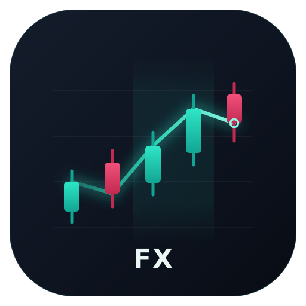
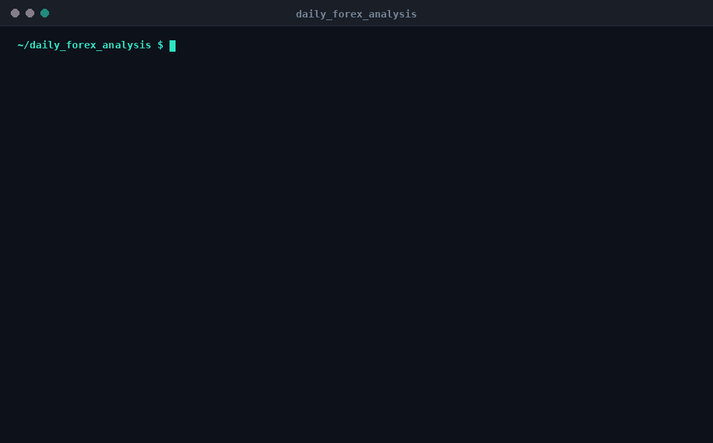

<div align="center">



# daily_forex_analysis

**현물 FX와 금속을 위한 LLM 보조 기술적 분석.**

pip 단위로 측정하는 멀티 타임프레임 지표 · 24/5 세션 인식 · 교체 가능한 데이터 제공자 · 자신의 API 키 사용

[](https://www.python.org/)
[](LICENSE)
[](#테스트)
[](#테스트)
[](#기여하기)

[English](README.md) ·
[简体中文](README.zh-CN.md) ·
[繁體中文](README.zh-TW.md) ·
[日本語](README.ja.md) ·
**한국어** ·
[Bahasa Indonesia](README.id.md) ·
[Español](README.es.md) ·
[Português](README.pt-BR.md) ·
[Français](README.fr.md) ·
[Deutsch](README.de.md) ·
[Русский](README.ru.md)

</div>

---

## 개요

`daily_forex_analysis`는 사용자가 접근할 수 있는 어떤 시장 데이터 제공자로부터든
캔들을 가져와 멀티 타임프레임 기술적 상황을 계산하고, 선택적으로 언어 모델에게
해석을 요청한 뒤, 터미널에서 읽거나 디스크에 저장하거나 Telegram으로 보낼 수 있는
리포트를 작성합니다.

Yahoo Finance를 사용하면 **설정도 API 키도 전혀 없이** 동작합니다. 그 외의 모든
기능 — 프리미엄 데이터, LLM 논평, 알림 — 은 사용자가 자신의 자격 증명을 제공할
때에만 활성화됩니다.

<div align="center">
  
</div>

```console
$ python main.py --symbols EURUSD,USDJPY --dry-run

### EUR/USD  ▲

Last price 1.15540 (source: yfinance)

Multi-timeframe read: **up** (confidence: medium) — timeframes agree on an uptrend

| Timeframe | Trend | RSI | ATR (pips) | Range position | Range width |
| --- | --- | --- | --- | --- | --- |
| H1 | ▲ up | 53.0 | 6.9 | 53% | 60 |
| D1 | → sideways | 60.4 | 56.0 | 89% | 225 |

- **H1**: fast EMA above slow EMA by 7.4 pips. RSI 53.0 mid-range; MACD histogram
  negative. ATR 6.9 pips (percentile 17 of recent history); compressed ranges often
  precede breakouts. High 1.158212, low 1.152206.

Most active during: London, New York
```

---

## 왜 이것이 라벨만 바꾼 주식 분석기가 아닌가

FX에는 주식에 대응물이 없는 관례들이 있습니다. 이를 잘못 다루면 화면에 표시되는
모든 숫자가 무의미해집니다.

| | 주식 | 현물 FX | 이 프로젝트의 처리 방식 |
| --- | --- | --- | --- |
| **가격 변동 단위** | 1센트는 언제나 1센트 | pip은 EUR/USD에서 0.0001이지만 USD/JPY에서는 0.01 | `instruments.py`가 각 통화쌍의 pip 크기를 관리하며, 어디에도 `0.0001`을 하드코딩하지 않음 |
| **거래 시간** | 거래소 개장과 폐장 | 연속 거래, 일요일 21:00 → 금요일 21:00 UTC | `sessions.py`가 현재 진행 중인 세션을 알려주고 London–New York 중첩 구간을 표시 |
| **가치 평가** | P/E, 이익, 장부가치 | 통화에는 이익이 없음 | 펀더멘털을 임의로 만들어내지 않음 |
| **상품 식별** | 불투명한 티커(`AAPL`) | 통화의 *쌍* | 심볼을 각자의 관례를 가진 기준통화와 상대통화로 파싱 |

0.0010의 움직임은 EUR/USD에서 **10 pip**, USD/JPY에서 **0.1 pip**입니다. 이
코드베이스의 모든 거리 값은 해당 상품 고유의 관례에서 도출됩니다.

---

## 설치

```bash
git clone https://github.com/0xgetz/daily_forex_analysis.git
cd daily_forex_analysis

python -m venv .venv
source .venv/bin/activate          # Windows: .venv\Scripts\activate

pip install -e ".[dev]"
```

Python 3.9 이상이 필요합니다.

---

## 빠른 시작

```bash
# Show configuration and which providers are usable — no network required
python main.py --check

# Analyse the default watchlist, print to stdout, write nothing
python main.py --dry-run

# Your pairs, your timeframes, written to reports/
python main.py --symbols EURUSD,GBPUSD,XAUUSD --timeframes H1,H4,D1

# Machine-readable output
python main.py --symbols EURUSD --format json
```

### CLI 참조

| 플래그 | 설명 |
| --- | --- |
| `--symbols` | 쉼표로 구분한 통화쌍, 예: `EURUSD,GBPUSD,XAUUSD` |
| `--timeframes` | `H1,H4,D1` 중 일부 |
| `--bars` | 타임프레임당 요청할 캔들 수(기본값 `300`) |
| `--provider` | `twelvedata`, `alphavantage`, `yfinance` 중 하나를 강제 지정 |
| `--format` | `markdown`(기본값) 또는 `json` |
| `--output-dir` | 리포트를 저장할 디렉터리 |
| `--dry-run` | 분석 후 출력만: LLM 호출 없음, 파일 없음, 알림 없음 |
| `--no-push` | 알림 생략 |
| `--stdout` | 리포트를 저장하면서 동시에 출력 |
| `--check` | 설정과 제공자 상태를 출력한 뒤 종료 |
| `--log-level` | `DEBUG`, `INFO`, `WARNING`, `ERROR` |

---

## 설정

`.env.example`을 `.env`로 복사한 뒤 필요한 항목만 채우세요. 모든 값은 환경 변수로도
지정할 수 있습니다.

### 데이터 제공자

제공자는 요청된 **모든** 타임프레임을 충족하는 것이 나올 때까지 순서대로 시도되므로,
하나의 리포트가 서로 다른 관례를 가진 소스를 섞는 일은 결코 없습니다. 자격 증명이
없는 제공자는 조용히 건너뜁니다.

| 제공자 | 자격 증명 | 비고 |
| --- | --- | --- |
| Twelve Data | `TWELVEDATA_API_KEY` | 네이티브 4시간 캔들 제공; 무료 등급 있음 |
| Alpha Vantage | `ALPHAVANTAGE_API_KEY` | FX 전용, 금속 없음; 무료 등급은 요청 제한 있음 |
| Yahoo Finance | *없음* | 기본 폴백, 키 불필요 |

`--provider twelvedata` 또는 `FOREX_PROVIDER`로 특정 제공자를 강제할 수 있습니다.

> [!NOTE]
> 미리 알아두면 좋은 Yahoo Finance의 두 가지 주의사항:
> - Yahoo에는 4시간 캔들이 없으므로 `H4`는 1시간 데이터에서 **리샘플링**됩니다.
> - Yahoo에는 금속 현물 시세가 없으므로 `XAUUSD`는 **COMEX 선물**(`GC=F`)에서
>   제공됩니다. 선물에는 베이시스와 롤 효과가 있어 브로커의 현물 가격과 레벨이
>   약간 다릅니다. 구조를 읽는 데에는 충분하지만 실제 체결용은 아닙니다.

### LLM 논평(선택)

OpenAI와 호환되는 모든 `/chat/completions` 엔드포인트를 사용할 수 있습니다.

```bash
LLM_API_KEY=sk-...
LLM_MODEL=gpt-4o-mini
LLM_BASE_URL=https://api.openai.com/v1
```

`LLM_BASE_URL`을 OpenRouter, DeepSeek, Groq, Together 또는 로컬
llama.cpp / vLLM 서버로 지정하면 그 외에는 바꿀 것이 없습니다. `OPENAI_API_KEY`,
`OPENROUTER_API_KEY`, `DEEPSEEK_API_KEY`, `GROQ_API_KEY` 모두 인식되므로 이미
가지고 있는 키의 이름을 바꿀 필요가 없습니다.

> [!IMPORTANT]
> 모델은 원시 캔들을 절대 보지 않으며 숫자를 만들어내지도 않습니다. 이미 계산된
> 수치를 받아 해석하도록 요청받을 뿐이며, 덕분에 모든 가격과 레벨은 결정론적이고
> 감사 가능한 상태로 유지됩니다. 키가 없어도 계산된 분석만으로 리포트가
> 생성됩니다.

### Telegram 전송(선택)

```bash
TELEGRAM_BOT_TOKEN=123456:ABC-DEF
TELEGRAM_CHAT_ID=987654321
```

[@BotFather](https://t.me/BotFather)로 봇을 만들고
[@userinfobot](https://t.me/userinfobot)에서 chat id를 확인하세요. `--no-push`로
전송을 생략할 수 있습니다. 전송이 실패해도 이미 작성된 리포트는 절대 버려지지
않습니다.

### 전체 설정 항목

| 변수 | 기본값 | 의미 |
| --- | --- | --- |
| `FOREX_SYMBOLS` | 메이저 + `XAUUSD` | 쉼표로 구분한 통화쌍 |
| `FOREX_TIMEFRAMES` | `H1,H4,D1` | H1, H4, D1 중 일부 |
| `FOREX_BARS` | `300` | 타임프레임당 요청할 캔들 수 |
| `FOREX_PROVIDER` | *자동* | 우선 사용할 제공자 이름 |
| `FOREX_OUTPUT_DIR` | `reports` | 리포트를 저장할 위치 |
| `FOREX_REPORT_FORMAT` | `markdown` | `markdown` 또는 `json` |
| `LOG_LEVEL` | `INFO` | `DEBUG`, `INFO`, `WARNING`, `ERROR` |

---

## 심볼

아래 표기법은 모두 동일한 상품으로 해석됩니다:

```
EURUSD    eur/usd    EUR-USD    EUR_USD    EURUSD=X
```

지원 대상: 메이저 및 마이너 통화쌍, 그리고 `XAUUSD`(금), `XAGUSD`(은),
`XPTUSD`(백금), `XPDUSD`(팔라듐).

---

## 무엇이 계산되는가

**타임프레임별**

- EMA(20/50) 추세. ATR에 비례한 노이즈 하한을 적용하여, 이동평균이 밀집한 경우
  거짓 추세가 아니라 *sideways*로 보고합니다
- Wilder RSI(14)
- MACD(12/26/9)
- ATR(14) 및 변동성 국면 백분위(수축 / 정상 / 확장)
- Bollinger 및 Donchian 채널
- 최근 레인지 내 위치, 그리고 pip 단위의 레인지 폭

**타임프레임 간**

명시적인 컨플루언스 판정 — `up`, `down`, `sideways` 또는 `conflicted` — 과 함께
신뢰도 수준을 제공합니다. 멀티 타임프레임의 일치는 재량적 FX 분석에서 가장 유용한
구조적 신호이므로, 모델이 알아서 추론하도록 남겨두지 않고 직접 계산하여 명확하게
표시합니다.

모든 거리 값은 해당 상품 고유의 관례에 따라 pip 단위로 표현됩니다.

---

## 스케줄링

**Cron** — 평일마다 07:00 UTC, London 개장 직후:

```cron
0 7 * * 1-5 cd /path/to/daily_forex_analysis && .venv/bin/python main.py
```

**GitHub Actions** — `.github/workflows/daily.yml`에 워크플로가 포함되어 있습니다
(`workflow_dispatch` 및 일일 스케줄). 키를 리포지토리 시크릿으로 추가하면 LLM과
Telegram 단계가 활성화되며, 시크릿이 없으면 해당 기능만 비활성화됩니다.

---

## 아키텍처

```
forex/
├── instruments.py   symbol parsing, pip conventions
├── sessions.py      24/5 market hours, Tokyo/London/New York sessions
├── providers.py     data sources with ordered fallback
├── analysis.py      indicators and structure (pure functions)
├── llm.py           optional commentary over computed readings
├── report.py        Markdown and JSON rendering
├── notify.py        optional Telegram push
├── config.py        environment / .env configuration
└── pipeline.py      fetch → analyse → interpret → render → notify
main.py              CLI
```

`analysis.py`는 순수합니다: DataFrame이 들어가고 숫자가 나옵니다. 네트워크도, 설정도,
LLM도 없습니다. 그래서 지표 테스트가 합성 시계열을 대상으로 완전히 오프라인에서
실행될 수 있습니다.

**장애 격리는 설계 목표입니다.** 하나의 통화쌍이 실패하면 실행 전체를 중단하지 않고
리포트의 Failures 섹션에 기록됩니다. LLM 호출이나 Telegram 전송이 실패해도 이미
계산된 리포트는 절대 버려지지 않습니다.

### 데이터 제공자 추가하기

`CandleProvider`를 상속해 두 개의 메서드를 구현하고 `build_providers()`에 추가하세요.
코드베이스의 다른 부분은 바꿀 필요가 없습니다.

```python
from forex.providers import CandleProvider

class MyProvider(CandleProvider):
    name = "myprovider"

    def is_available(self) -> bool:
        return bool(os.getenv("MY_API_KEY"))

    def fetch(self, instrument, timeframe, bars):
        ...  # return a DataFrame with open/high/low/close
```

---

## 테스트

```bash
python -m pytest          # 178 tests
```

어떤 테스트도 네트워크에 접근하지 않습니다. 제공자는 스텁으로 대체되고, 캔들은 시드가
고정된 합성 데이터이며, 지표는 손으로 계산할 수 있는 사례로 검증됩니다 — 단조 상승은
RSI 100을 내야 하고, 갭 상승 캔들의 true range는 이전 종가를 사용해야 하며, 동일한
ATR은 JPY 통화쌍에서 pip 기준으로 100배 작게 나와야 합니다.

> [!NOTE]
> 함께 제공되는 CI 워크플로는 이 리포지토리에서 GitHub Actions가 활성화될 때까지
> 실행할 수 없습니다. 잠긴 계정이나 결제가 설정되지 않은 계정에서는 모든 실행이
> 시작 전에 실패합니다. 위의 수치는 Python 3.14에서의 로컬 실행과 별도의 가상
> 환경에 새로 editable 설치한 결과에서 얻은 것입니다.

---

## 종료 코드

| 코드 | 의미 |
| --- | --- |
| `0` | 최소 한 개의 통화쌍이 분석됨 |
| `1` | 모든 통화쌍이 실패함 |
| `2` | 잘못된 심볼 인자 |

---

## 기여하기

이슈와 풀 리퀘스트를 환영합니다. 유용한 기여로는 새로운 데이터 제공자, 추가 지표,
알림 채널, 그리고 README 번역이 있습니다.

`analysis.py`는 순수하게 유지하고 네트워크 호출을 넣지 말아 주세요. 또한 오프라인에서
실행되는 테스트를 함께 추가해 주세요.

---

## 면책 조항

이 프로젝트는 **교육 목적**으로 공개 시장 데이터에서 기술적 판독값을 산출합니다.
무엇을 사거나 팔아야 하는지 알려주지 않으며, 사용자 자신의 분석이나 공인 재무
상담사를 대신하지 않습니다. 무료 데이터 소스는 지연되거나 잘못될 수 있습니다 —
여기 나온 내용에 따라 행동하기 전에 브로커에서 가격을 확인하세요. 외환 거래에는
상당한 손실 위험이 따릅니다.

---

## 라이선스

[MIT](LICENSE)

[ZhuLinsen/daily_stock_analysis](https://github.com/ZhuLinsen/daily_stock_analysis)의
파이프라인 구조에서 영감을 받았습니다.
이것은 FX를 위한 독립적인 구현이며 해당 프로젝트와 코드를 공유하지 않습니다.
